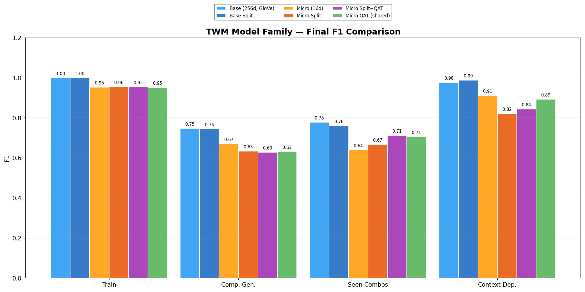
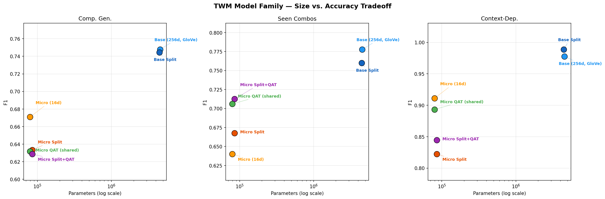

# Triple World Model (TWM)

> A state machine that discovers its own states. Learns transition rules from
> examples instead of specifications. Resolves variable interactions through
> attention rather than exponential enumeration. Scales down to as few as
> 4K parameters (Micro) and runs client-side in 303 KB of JavaScript.

A minimal world model that learns state dynamics over structured
(entity, attribute, value) triples using a vanilla transformer encoder.

**The core claim**: a small transformer over decomposed triple tokens can learn
compositional state transformations that generalize to novel entity-state
combinations never seen in training — and it needs cross-position attention
to do it.

## Results

Trained on 1,371 examples from 3 domains (handwritten physics, ProPara, OpenPI).
Evaluated on held-out splits: compositional generalization (55), seen combos (26),
and context-dependent cross-entity reasoning (30).

### vs. Baselines (F1)

| Model | Params | Size | Context-Dep | Comp Gen | Seen |
|-------|-------:|-----:|:---:|:---:|:---:|
| Copy baseline | — | — | 0.29 | 0.29 | 0.29 |
| Qwen3-VL 8B (5-shot) | 8B | ~16 GB | 0.59 | 0.56 | 0.57 |
| MLP + GloVe (no attention) | 4.5M | 17 MB | 0.76 | 0.70 | 0.64 |
| **TWM Base** | **4.5M** | **17 MB** | **0.98** | **0.75** | **0.78** |
| **TWM Mini** | **178K** | **695 KB** | **0.98** | **0.71** | **0.78** |
| **TWM Micro** | **80K** | **311 KB** | **0.91** | **0.67** | **0.64** |

The context-dependent test is the key result: when a triple's output
depends on what other triples are present (glass stays full if nobody's thirsty,
fire goes out if wind is gusty), the MLP can't solve it because it processes
each position independently. The transformer attends across positions and
gets **+23% F1** over the MLP — and this holds across all model sizes.

Mini (32d, 2 layers, 2 heads) matches Base on context-dependent F1 (0.978)
at 25x fewer parameters. Micro (16d, 1 layer) retains the attention advantage
at 57x compression.

### Model Family

| Model | d_model | Layers | Heads | Params | Size | Context F1 | Comp Gen F1 | Seen F1 |
|-------|--------:|-------:|------:|-------:|-----:|:---:|:---:|:---:|
| Base (GloVe) | 256 | 4 | 4 | 4.5M | 17 MB | 0.978 | 0.748 | 0.778 |
| Base Split | 256 | 4 | 4 | 4.5M | 17 MB | 0.989 | 0.745 | 0.760 |
| **Mini** | **32** | **2** | **2** | **178K** | **695 KB** | **0.978** | **0.714** | **0.777** |
| Micro | 16 | 1 | 2 | 80K | 311 KB | 0.911 | 0.671 | 0.640 |
| Micro QAT | 16 | 1 | 2 | 80K | 311 KB | 0.893 | 0.632 | 0.706 |
| Micro Split | 16 | 1 | 2 | 85K | 334 KB | 0.822 | 0.633 | 0.668 |





Key findings:
- **Mini matches Base on context-dependent reasoning** — 0.978 F1 at 25x fewer params
- **Attention works at 16d/2-head** — context-dependent F1 drops only 7% at Micro scale
- **Split embedding tables help at base scale** (+0.011 context) but **hurt at micro** (-0.089)
- **QAT is essentially free** — simulated int8 quantization noise costs <2% F1
- **Domain-specific deployment**: with a small vocab (~50 tokens), Micro shrinks to ~4K params / ~5 KB at int8

See [results/README.md](results/README.md) for full experiment progression
(8 runs) and analysis.

### Browser Demo: Pet Simulator

A live demo running TWM entirely client-side — pure JavaScript transformer
inference, no server, no WASM, no WebGPU. Model weights ship as a 303 KB
JSON file.

The pet simulator models multi-pet dynamics: 6 attributes × 4 levels, conditional
cross-state effects (playing when exhausted drops mood, cats hate baths),
energy-based competition, and vocalization triggers (bark/meow). All learned
from 11K generated training examples by a 29K parameter model at 98.9%
compositional generalization exact match.

Try it: `cd demo/pet_simulation && python -m http.server 8080`

## How It Works

At the center is the **dynamics core** — a transformer that processes triples
in latent space. You can use it directly with a fixed token set (pet sim,
benchmarks), or wrap it with a **compressor/expander** for open-vocabulary
and other use cases:

```
  Direct (fixed token set)              With I/O wrappers (open-vocab)
  ────────────────────────              ─────────────────────────────
  token IDs → Encoder                  BPE text → Compressor
                  │                                    │
                  ▼                                    ▼
             ┌──────────┐                        ┌──────────┐
             │ Dynamics │                        │ Dynamics │
             │  (core)  │                        │  (core)  │
             └────┬─────┘                        └─────┬────┘
                  │                                    │
                  ▼                                    ▼
         Decoder → logits               Expander → BPE text
                                        (iterative denoising)
```

The dynamics core sees the same shaped input either way — `(B, max_triples × 3, d_model)`
latent tensors. The I/O layers are interchangeable.

### Example (closed-vocab, pet sim)

```
Input: mode triple + current state + action

  (#mode, type, advance)                    <- mode conditioning
  (Buddy, hunger, hungry)                   <- state triples
  (Buddy, energy, rested)
  (Buddy, mood, content)
  (Buddy, action, feed)                     <- action triple

Tokenized (3 tokens per triple):
  [#mode] [type] [advance] [Buddy] [hunger] [hungry] ...
  + positional encoding: (triple_index, role: entity/attr/value)

  → Encoder → Dynamics (2L/2H/32d) → Decoder

Output: predicted state

  (Buddy, hunger, full)                     <- hunger improved
  (Buddy, energy, rested)                   <- unchanged
  (Buddy, mood, content)                    <- unchanged
```

- **Mode conditioning**: `(#mode, type, advance)` is prepended as a regular triple —
  no architecture changes needed. `identity` mode (input → same output) validates
  reconstruction. Other modes (e.g., `query`) are just training data.
- **Set-to-set prediction** (not autoregressive) — triples have no natural order
- **Input residual**: most of the state persists, model only learns the delta
- **Padding mask** for variable-length triple sets (8-16 triples depending on profile)

Full architecture details and file map: [`research/architecture.md`](research/architecture.md)

## Quick Start

Requires Python 3.11+ and [uv](https://docs.astral.sh/uv/).

```bash
# Install dependencies
uv sync

# Train the base model
uv run python -m twm.train \
  --data-dir data/combined \
  --out-dir results/my_run \
  --config base \
  --pretrained-embeds data/combined/pretrained_embeds.pt \
  --epochs 500

# Train the mini model (browser / mobile deployment)
uv run python -m twm.train \
  --data-dir data/combined \
  --out-dir results/my_mini_run \
  --config mini \
  --epochs 500

# Train the micro model (embedded / edge deployment)
uv run python -m twm.train \
  --data-dir data/combined \
  --out-dir results/my_micro_run \
  --config micro \
  --epochs 500

# Evaluate on all test splits
uv run python -m twm.metrics \
  --checkpoint results/my_run \
  --data-dir data/combined \
  --split all
```

### Config profiles

| Profile | d_model | Layers | Heads | d_ff | Max Triples | Target |
|---------|--------:|-------:|------:|-----:|------------:|--------|
| `base` | 256 | 4 | 4 | 1024 | 8 | GPU training/inference |
| `mini` | 32 | 2 | 2 | 128 | 8 | Browser / mobile deployment |
| `micro` | 16 | 1 | 2 | 32 | 8 | ESP32 / edge deployment |
| `atomic` | 256 | 4 | 4 | 1024 | 12 | ATOMIC 2020 (open-vocab) |

Additional flags:
- `--split-embeddings` — separate entity/attr/value embedding tables
- `--quantize-aware` — simulate int8 quantization during training

### Inference

```bash
# Interactive REPL
uv run python -m twm.serve \
  --checkpoint results/my_run --interactive

# Single prediction (prepend mode triple for models trained with mode conditioning)
uv run python -m twm.serve \
  --checkpoint results/my_run \
  --input '[["#mode","type","advance"],["glass","state","full"],["alice","state","thirsty"]]'
```

### Rebuilding from scratch

```bash
# 1. Build GloVe pretrained embeddings (downloads ~1GB model on first run)
uv run python scripts/build_pretrained_embeds.py \
  --vocab data/combined/vocab.json \
  --output data/combined/pretrained_embeds.pt

# 2. Train the transformer
uv run python -m twm.train \
  --data-dir data/combined \
  --out-dir results/my_run \
  --config base \
  --pretrained-embeds data/combined/pretrained_embeds.pt

# 3. Run MLP baseline comparison
uv run python scripts/run_mlp_baseline.py

# 4. Run model family benchmark
uv run python scripts/benchmark_family.py \
  --data-dir data/combined \
  --results-dir results/family_benchmark \
  --epochs 500
```

## Project Structure

See [`research/architecture.md`](research/architecture.md#project-structure) for the full file map.

## Training Data

### Closed-Vocabulary Benchmark (3-domain)

| Source | Examples | What it adds |
|--------|:---:|-------------|
| Handwritten | 121 | Kitchen physics, weather, social, mechanics |
| ProPara | 738 | Location tracking from procedural text |
| OpenPI | 429 | Diverse attributes: cleanness, temperature, moisture |
| Context-dependent | 83 | Cross-entity interactions requiring attention |
| **Total** | **1,371** | |

### Domain-Specific (Pet Simulator)

| Split | Examples | What it tests |
|-------|:---:|-------------|
| Train | 11,378 | 6 attrs × 4 levels, conditional effects, interactions |
| Test comp | 2,243 | Held-out pet × action combos (Daisy, Rocky) |
| Test seen | 699 | Seen combos, unseen states |

## Open-Vocabulary Results (ATOMIC 2020)

Extends TWM to handle free-text values ("to be helpful", "embarrassed") using
the open-vocab pipeline: **compressor** (BPE → 256d latent per slot) →
**dynamics** (frozen TWM core) → **expander** (256d → BPE via iterative denoising).
A **length head** (256 params) predicts token count per slot for truncation.

### TWM vs. Frontier LLMs on ATOMIC Triple Prediction

5-shot prompted frontier models on the same ATOMIC test set. Task: given input
triples (intents, needs, preconditions), predict output triples (attributes,
effects, reactions).

| Model | Relation Accuracy | Exact Value Match | Notes |
|-------|:-:|:-:|-------|
| Claude Opus 4.6 | 4-6/8 | 2/8 | Defaults to all-attribute |
| Gemini 3 Pro | 5-7/8 | 0-1/8 | Better relation diversity |
| Gemini 3.1 Pro | 4-6/8 | 2/8 | Nearly identical to Claude |
| GPT 5.4 Thinking | 6-8/8 | 0-1/8 | Best relation distribution |
| **TWM 3L/256d** (ours) | **100% attr** | **81.1% exact** | 10K examples, 310 epochs |

Frontier models produce semantically reasonable but wrong values — they have
the commonsense knowledge but can't match annotation conventions without
training. TWM learns the mapping directly.

### Expander Scaling

| Denoiser Depth | Exact Match | Token Accuracy | Entity Exact | Params |
|----------------|:-----------:|:--------------:|:------------:|-------:|
| 1L, 256d | 55.1% | 80.5% | 62.0% | ~10M |
| 2L, 256d | 71.1% | 89.4% | 63.3% | ~11M |
| **3L, 256d** | **81.1%** | **93.4%** | **75.5%** | **~12M** |

Each denoiser layer adds a refinement pass — gains concentrate on medium and long phrases. Short phrases (1-3 BPE tokens) hit 100% at all depths.

### Key Takeaways

- **Joint compressor/expander training** was the breakthrough — sentence encoder hit 34%, BPE compressor hit 81%
- **Expander depth scales predictably**: +16% exact match per layer (1L→2L), diminishing after
- **28K param dynamics core** runs a live pet simulator with multi-entity interactions — no game logic, no if-statements, just learned world dynamics

Full experiment progression and 12-entry problem/solution log: [`research/sprint3_diffusion_decoder.md`](research/sprint3_diffusion_decoder.md)

## Key Design Decisions

- **Decomposed triples, not sentence embeddings.** Each entity/attribute/value
  is its own token. Compositionality comes from structure, not embedding space.
- **Set-to-set, not autoregressive.** Parallel prediction of all output
  positions. Closer to BERT than GPT.
- **Embedding-agnostic.** The dynamics core doesn't prescribe a preferred
  embedding space. Closed-vocab models use learned embeddings from scratch.
  The open-vocab pipeline uses a BPE compressor/expander pair that provides
  the vector space — the dynamics core learns to operate within it through
  training. The 81.1% exact match result uses BPE on both compressor and
  expander with an identity transfer function (pure reconstruction), not yet
  with world dynamics active.
- **Input residual.** Most of the state persists across transformations. The
  model only needs to learn what changes.
