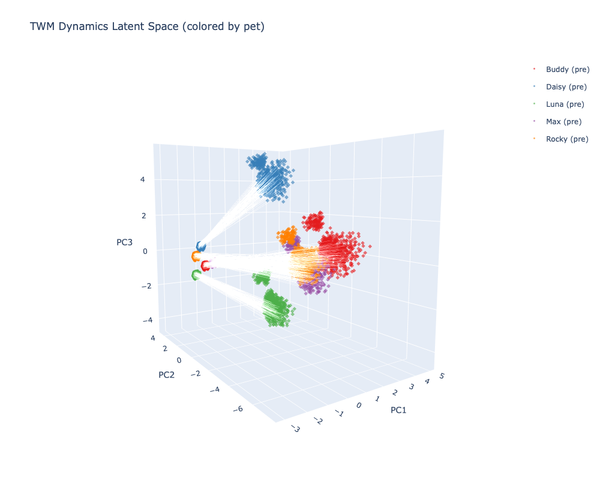

# Triple World Model (TWM)

- A state machine that discovers its own states from your data.
- A minimal world model that learns state dynamics over structured
(entity, attribute, value) triples.
- Scales down to as few as 4K parameters (Micro variant) and runs client-side in 303 KB of JavaScript.
- Modular world dynamics with pluggable natural-language I/O (Mini variant and above) (*Experimental!*).

**The core claim**: a small transformer over decomposed triple tokens can learn
compositional state transformations that generalize to novel entity-state
combinations never seen in training — and it needs cross-position attention to do it.

## Active Development

This project is under active development. The core pieces of TWM are there, including experimental encoder/decoder plugins for natural language processing.
When this project is ready for public use, it will include more information on adapting it your specific use-case, including a guided wizard.
For now, thanks for checking this out!


## How It Works

At the center is the **dynamics core** — a transformer that processes triples
in latent space. You can use it directly with a fixed token set (simulations, domain-specific rules, process automation, benchmarks), or wrap it with a **compressor/expander** for open-vocabulary, natural language and other use cases.

The dynamics core sees the same shaped input either way — `(B, max_triples × 3, d_model)`
latent tensors. The I/O layers are interchangeable.

### Core Features

- **Mode conditioning**: `(#mode, type, advance)` is prepended as a regular triple —
  no architecture changes needed. `identity` mode (input → same output) validates
  reconstruction. Other modes (e.g., `query`) are just training data.
- **Set-to-set prediction** (not autoregressive) — triples have no natural order
- **Input residual**: most of the state persists, model only learns the delta
- **Padding mask** for variable-length triple sets (8-16 triples depending on profile)
- **Modular interfaces** (*Experimental!*) for extending applicability into other domains. Currently working on diffusion-based token-level output: [research/sprint4_config_driven_training.md](research/sprint4_config_driven_training.md).

Full architecture details and file map: [`research/architecture.md`](research/architecture.md)

## Quick Start

Requires Python 3.11+ and [uv](https://docs.astral.sh/uv/).

```bash
uv sync
```

Training is config-driven. Define your experiment as a JSON config and run:

```bash
uv run python scripts/train.py configs/example_recipe.json
```

See [`configs/README.md`](configs/README.md) for full recipes (edge deployment, IO-only, full dynamics, base scale) and curriculum design guide.

## Results

### Open-Vocab: WebNLG (210K+ training pairs)

35K WebNLG knowledge graph entries with natural language, expanded to 210K+ QA pairs. The compressor/expander learns to encode/decode free text through a bottleneck, then the dynamics core learns question→answer transformations with the IO pipeline frozen.

**Sprint 4 results:**
- **IO pipeline**: 96.9% exact match on identity reconstruction via graduated t-range curriculum
- **Mode warmup**: dynamics core learns to read mode conditioning (identity vs reverse), confirmed via attention diagnostics
- **Dynamics**: QA mode collapses — the core maps all QA inputs to a single bottleneck point rather than learning diverse transformations
- **Root cause identified**: PCA of compressor bottleneck reveals a 1D manifold (86% variance in PC1). The compressor finds *an* encoding that decodes correctly, but with no geometric constraint it collapses role structure. The dynamics core has no room to work in a 1D space.

| Stage | Metric | Result |
|-------|--------|--------|
| IO (identity reconstruction) | Exact match | 96.9% |
| Mode warmup (identity + reverse) | Mode attention differential | Forming across all layers |
| Dynamics (question → answer) | QA token accuracy | ~12% (mode collapse) |

**Sprint 5 direction: Role-conditioned VAE prior.** Replace the soft role centroid regularizer with a proper VAE — μ/log_σ projection heads after the compressor, KL divergence against learned per-role priors (entity, attribute, value). This forces the bottleneck into at minimum 3D role-structured geometry, giving the dynamics core room to learn content-dependent transformations. See [research/sprint4_config_driven_training.md](research/sprint4_config_driven_training.md) for full diagnosis and plan.

Training is config-driven with staged curriculum — see [Quick Start](#quick-start) and [`configs/README.md`](configs/README.md).

### Pet Simulator (11K examples, 98.9% exact match)

A live demo running TWM entirely client-side — pure JavaScript transformer
inference, no server, no WASM, no WebGPU. Model weights ship as a 303 KB
JSON file.

The pet simulator models multi-pet dynamics: 6 attributes × 4 levels, conditional
cross-state effects (playing when exhausted drops mood, cats hate baths),
energy-based competition, and vocalization triggers (bark/meow). All learned
from 11K generated training examples by a 29K parameter model at 98.9%
compositional generalization exact match.

Try it: `cd demo/pet_simulation && python -m http.server 8080`

#### What the dynamics core actually learns



Geometry analysis of the pet sim latent space (3,780 states, PCA to 3D) reveals the dynamics core learned a single shared next-state function — pet identity acts as a conditioning signal that adjusts the flow, not a selector for entirely different dynamics. The Jacobian eigenspectrum confirms nontrivial structure: a mix of expansive and contractive directions (mean |λ| ≈ 1.0), not simple contraction or noise. More graphs are included in sprint logs [research/sprint4_config_driven_training.md](research/sprint4_config_driven_training.md).

See [analysis tools](#dynamics-analysis) below for notes on creating your own graphs from your TWMs.

### Compositional Generalization Benchmark (1.4K examples)

Initial validation on a small handcrafted benchmark confirming that decomposed triples + attention enable compositional generalization. Key finding: the transformer's cross-position attention gives **+23% F1** over an MLP baseline on context-dependent reasoning, and Mini (178K params) matches Base (4.5M params) on this metric.

<details>
<summary>Full benchmark results</summary>

| Model | Params | Size | Context-Dep | Comp Gen | Seen |
|-------|-------:|-----:|:---:|:---:|:---:|
| Copy baseline | — | — | 0.29 | 0.29 | 0.29 |
| Qwen3-VL 8B (5-shot) | 8B | ~16 GB | 0.59 | 0.56 | 0.57 |
| MLP + GloVe (no attention) | 4.5M | 17 MB | 0.76 | 0.70 | 0.64 |
| **TWM Base** | **4.5M** | **17 MB** | **0.98** | **0.75** | **0.78** |
| **TWM Mini** | **178K** | **695 KB** | **0.98** | **0.71** | **0.78** |
| **TWM Micro** | **80K** | **311 KB** | **0.91** | **0.67** | **0.64** |

| Model | d_model | Layers | Heads | Params | Size | Context F1 | Comp Gen F1 | Seen F1 |
|-------|--------:|-------:|------:|-------:|-----:|:---:|:---:|:---:|
| Base (GloVe) | 256 | 4 | 4 | 4.5M | 17 MB | 0.978 | 0.748 | 0.778 |
| Base Split | 256 | 4 | 4 | 4.5M | 17 MB | 0.989 | 0.745 | 0.760 |
| **Mini** | **32** | **2** | **2** | **178K** | **695 KB** | **0.978** | **0.714** | **0.777** |
| Micro | 16 | 1 | 2 | 80K | 311 KB | 0.911 | 0.671 | 0.640 |
| Micro QAT | 16 | 1 | 2 | 80K | 311 KB | 0.893 | 0.632 | 0.706 |
| Micro Split | 16 | 1 | 2 | 85K | 334 KB | 0.822 | 0.633 | 0.668 |


See [results/README.md](results/README.md) for full experiment progression (8 runs) and analysis.

</details>

### Open-vocab training (compressor/expander + dynamics)

```bash
# 1. Prepare data + train BPE tokenizer
uv run python scripts/prepare_webnlg_multimodal.py --out-dir data/webnlg_multi

# 2. Generate identity + QA datasets
uv run python scripts/generate_qa_dataset.py \
  --input data/webnlg_multi/train.jsonl \
  --output-dir data/webnlg_multi --split train
uv run python scripts/generate_qa_dataset.py \
  --input data/webnlg_multi/test.jsonl \
  --output-dir data/webnlg_multi --split test

# 3. Train (IO stage learns encode/decode, dynamics stage learns transformations)
# Points to latest experiment at time of writing, you can use your own recipe here.
uv run python scripts/train.py configs/v20_mini64.json
```

### Closed-vocab training (fixed token set)

```bash
uv run python -m twm.train \
  --data-dir data/combined \
  --out-dir results/my_run \
  --config base \
  --epochs 500
```

**Staged training**: IO stage trains compressor/expander with identity reconstruction. Dynamics stage freezes IO and trains the dynamics core to transform questions into answers. Checkpoints chain automatically between stages.

**Graduated curriculum**: The diffusion noise range narrows across phases — `[0.7,1.0]` → `[0.4,1.0]` → `[0.0,1.0]` — so the model learns coarse structure first, then refines.

### Inference

Generally, the longest part of inference is loading the model and weights.
If you can keep the model running via a server or persistent binary, you will get far faster inference times than if you ran a separate CLI command for each one.

```python
from twm import TextDynamicsModel
model = TextDynamicsModel.load("results/my_run/")
# model.compress() → model.forward_dynamics() → model.generate()
```

```bash
# Interactive REPL (closed-vocab)
uv run python -m twm.serve \
  --checkpoint results/my_run --interactive
```

## Dynamics Analysis

Tools for understanding how the dynamics core transforms state. Requires viz extras: `uv sync --extra viz`.

```bash
# 3D latent space scatter (pre/post dynamics, colored by pet/action/attribute)
uv run python scripts/visualize_dynamics.py --checkpoint results/pet_sim

# Jacobian eigenspectrum at a representative state
uv run python scripts/visualize_dynamics.py --checkpoint results/pet_sim --eigenspectrum

# Flow field (displacement arrows in PCA space)
uv run python scripts/visualize_dynamics.py --checkpoint results/pet_sim --flow-field
```

Outputs interactive HTML to the checkpoint directory. The reusable analysis functions live in `src/twm/analysis.py`:

```python
from twm.analysis import dynamics_jacobian, flow_field, eigenspectrum_plot

# Jacobian eigendecomposition at a given state
eigenvalues, J = dynamics_jacobian(model, input_ids)

# Flow field: pre→post displacement in PCA space
origins, displacements = flow_field(model, input_ids_batch, pca)
```

## Project Structure and Architecture

See [`research/architecture.md`](research/architecture.md#project-structure) for the full file map.

## Training Data

### Open-Vocabulary: WebNLG (35K examples, 210K+ QA pairs)

The current focus. 35K knowledge graph entries from WebNLG with paired natural language descriptions, expanded to 210K+ QA pairs via question templates.

| Dataset | Examples | Purpose |
|---------|:---:|---------|
| Identity train | 61,666 | Compressor/expander reconstruction |
| QA train | 211,279 | Dynamics: question → answer (175K QA + 35K identity) |
| Identity test | 9,614 | IO evaluation |
| QA test | 9,738 | Dynamics evaluation |

### Domain-Specific: Pet Simulator (14K examples)

| Split | Examples | What it tests |
|-------|:---:|-------------|
| Train | 11,378 | 6 attrs × 4 levels, conditional effects, interactions |
| Test comp | 2,243 | Held-out pet × action combos (Daisy, Rocky) |
| Test seen | 699 | Seen combos, unseen states |

### Earlier: ATOMIC 2020 (10K examples)

Used to validate the open-vocab compressor/expander architecture. Achieved 81.1% exact match on identity reconstruction. ATOMIC's noisy annotations made it a poor fit for dynamics training — WebNLG provides cleaner data for the full pipeline.

### Closed-Vocabulary Benchmark (1.4K examples, 3 domains)

| Source | Examples | What it adds |
|--------|:---:|-------------|
| Handwritten | 121 | Kitchen physics, weather, social, mechanics |
| ProPara | 738 | Location tracking from procedural text |
| OpenPI | 429 | Diverse attributes: cleanness, temperature, moisture |
| Context-dependent | 83 | Cross-entity interactions requiring attention |
| **Total** | **1,371** | |