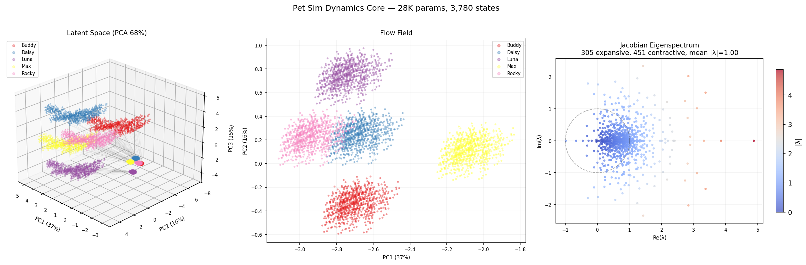

# Triple World Model (TWM)

A minimal world model that learns state dynamics over structured (entity, attribute, value) triples using a small transformer. The dynamics core processes triples in latent space and can be unrolled multiple times for multi-step causal reasoning.

**Core claim**: a small transformer over decomposed triple tokens can learn compositional state transformations that generalize to novel entity-state combinations — and multi-turn unrolling provides natural regularization without spectral penalties or VAE tricks.

## Active Development

This project is under active development. For architecture details see [research/architecture.md](research/architecture.md). For experiment logs see [research/](research/).

## How It Works

```
text / triples → Compressor → [mode | bottleneck] → Dynamics → Expander → text / triples
                                                         ↺
                                                    (unroll N times)
```

The **dynamics core** is a transformer that processes triples in latent space. It sees `(B, max_triples × 3, d_model)` tensors regardless of input format. A **mode triple** is prepended to condition the transformation (advance, query, identity). The core uses an **input residual** — it learns deltas, not full outputs.

For multi-turn dynamics, the core is unrolled N times with supervised intermediate states. This forces it to learn composable single-step transformations.

## Quick Start

Requires Python 3.11+ and [uv](https://docs.astral.sh/uv/).

```bash
uv sync

# Single-turn training (config-driven)
uv run python scripts/train.py configs/example_recipe.json

# Multi-turn chain training (GLUCOSE causal chains)
uv run python scripts/convert_glucose.py --annotation general --augment
uv run python scripts/train_chain.py configs/glucose_chain_v2.json
```

See [`configs/README.md`](configs/README.md) for training recipes and curriculum design.

## Results

### Multi-Turn Chain Dynamics: GLUCOSE (36K chains)

Causal reasoning over GLUCOSE story annotations. The dynamics core unrolls twice per chain: preconditions → event → consequences. No spectral loss, no VAE, no staging.

| Run | Modes | Train examples | Eval tok_acc | Epochs |
|-----|-------|---------------:|-------------:|-------:|
| v1 | advance only | 36K | 87.8% | 90 |
| v2 | advance + query + identity | 120K | *running* | — |

Multi-turn unrolling naturally regularizes bottleneck geometry — the dynamics output must be a valid input to itself, preventing collapse without explicit penalties.

### Open-Vocab IO: WebNLG (210K+ pairs)

Compressor/expander learns to encode/decode free text through a bottleneck, then the dynamics core learns transformations.

| Stage | Metric | Result |
|-------|--------|--------|
| IO (identity reconstruction) | Token accuracy | 99.3% |
| IO (identity reconstruction) | Exact match | 96.9% |
| Dynamics (question → answer) | Token accuracy | 36.8% |

Details: [research/sprint5_vae_bottleneck.md](research/sprint5_vae_bottleneck.md)

### Pet Simulator (11K examples, 98.9% exact match)

Client-side JS inference demo — 29K params, 303 KB, no server. Models multi-pet dynamics with conditional cross-state effects.

Try it: `cd demo/pet_simulation && python -m http.server 8080`

<details>
<summary>Dynamics analysis</summary>



**Left**: 3D latent space — per-pet clusters with pre→post flow. **Center**: flow field — displacement arrows show global transport with pet-specific offsets. **Right**: Jacobian eigenspectrum — 305 expansive, 451 contractive directions, confirming nontrivial dynamics.

</details>

### Compositional Generalization (1.4K examples)

Decomposed triples + attention enable compositional generalization. Mini (178K params) matches Base (4.5M) on context-dependent reasoning. Cross-position attention gives +23% F1 over MLP baseline.

<details>
<summary>Benchmark table</summary>

| Model | Params | Context-Dep F1 | Comp Gen F1 | Seen F1 |
|-------|-------:|:---:|:---:|:---:|
| MLP + GloVe | 4.5M | 0.76 | 0.70 | 0.64 |
| **TWM Base** | **4.5M** | **0.98** | **0.75** | **0.78** |
| **TWM Mini** | **178K** | **0.98** | **0.71** | **0.78** |
| TWM Micro | 80K | 0.91 | 0.67 | 0.64 |

</details>

## Inference

```python
from twm import TextDynamicsModel
model = TextDynamicsModel.load("results/my_run/")
# model.compress() → model.forward_dynamics() → model.generate()
```

## Project Structure

See [`research/architecture.md`](research/architecture.md) for the full file map and architecture diagrams.

## Dynamics Analysis

Tools for understanding how the dynamics core transforms state. Requires: `uv sync --extra viz`.

```bash
uv run python scripts/visualize_dynamics.py --checkpoint results/pet_sim
uv run python scripts/visualize_dynamics.py --checkpoint results/pet_sim --eigenspectrum
uv run python scripts/visualize_dynamics.py --checkpoint results/pet_sim --flow-field
```

```python
from twm.analysis import dynamics_jacobian, flow_field
eigenvalues, J = dynamics_jacobian(model, input_ids)
```
