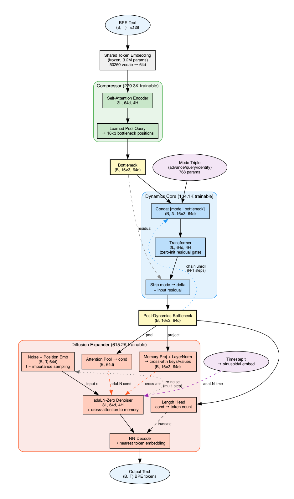

# Architecture

At the center of TWM is the **dynamics core** — a transformer that processes triples
in latent space. It can be used directly with a fixed token set, or wrapped with
a **compressor/expander** pair for open-vocabulary text.



## Modes

**Direct (closed-vocab):** token IDs → Encoder → Dynamics → Decoder → logits. Thin
wrappers around the dynamics core. Used for pet simulator, family benchmark.

**Wrapped (open-vocab):** BPE text → Compressor → Dynamics → Expander → BPE text.
Learned pipeline for free-text domains (ATOMIC, Wikipedia, TextWorld).

The dynamics core sees identical input either way — `(B, max_triples × 3, d_model)`
latent tensors. The I/O layers are interchangeable.

## Components

**Compressor** (`TextCompressor`): Frozen BPE embeddings → self-attention encoder →
learned pool query → one d-dimensional vector per triple slot. Compresses variable-length
text into fixed-width bottleneck positions.

**Dynamics** (`TransformerDynamics`): Self-attention over all triple positions (data + mode
triple). Zero-initialized residual gate — starts as identity, learns the delta. Mode
conditioning via a prepended learned triple (`#mode, type, advance/query/identity`).

**Expander** (`TextExpander`): Diffusion denoiser that reconstructs BPE text from
bottleneck conditioning. Three conditioning pathways:
- **adaLN**: pooled bottleneck → adaptive layer normalization (gamma/beta/gate per layer)
- **Cross-attention**: projected bottleneck positions → memory tokens (keys/values)
- **Timestep**: sinusoidal embedding → adaLN (denoising stage signal)

x₀-prediction: denoiser predicts clean embeddings directly, decoded via nearest-neighbor
lookup against the frozen BPE embedding table. Length head predicts token count for truncation.

**Shared embeddings**: Frozen, unit-normalized BPE embeddings shared between compressor
input and expander NN-decode target. Prevents embedding collapse under continuous noise.

## Key Design Choices

- **Set-to-set, not autoregressive.** All output positions predicted simultaneously.
- **Input residual.** Dynamics learns the delta. Identity is the default at init.
- **Continuous diffusion.** Gaussian noise in embedding space with cosine schedule.
  Eliminates the masking discontinuity of discrete diffusion.
- **adaLN-Zero.** Gates start at zero (identity init), gradually turn on. Each
  conditioning signal (bottleneck, timestep, position) gets its own projection — no
  additive mixing.
- **Cross-attention to memory.** Each denoising position attends to all bottleneck
  positions. This is where the expander reads *what* to reconstruct.

## Regenerating the Diagram

```bash
uv run python scripts/visualize_architecture.py --config configs/mixed_chain_v18.json --output research/architecture_diagram
```
