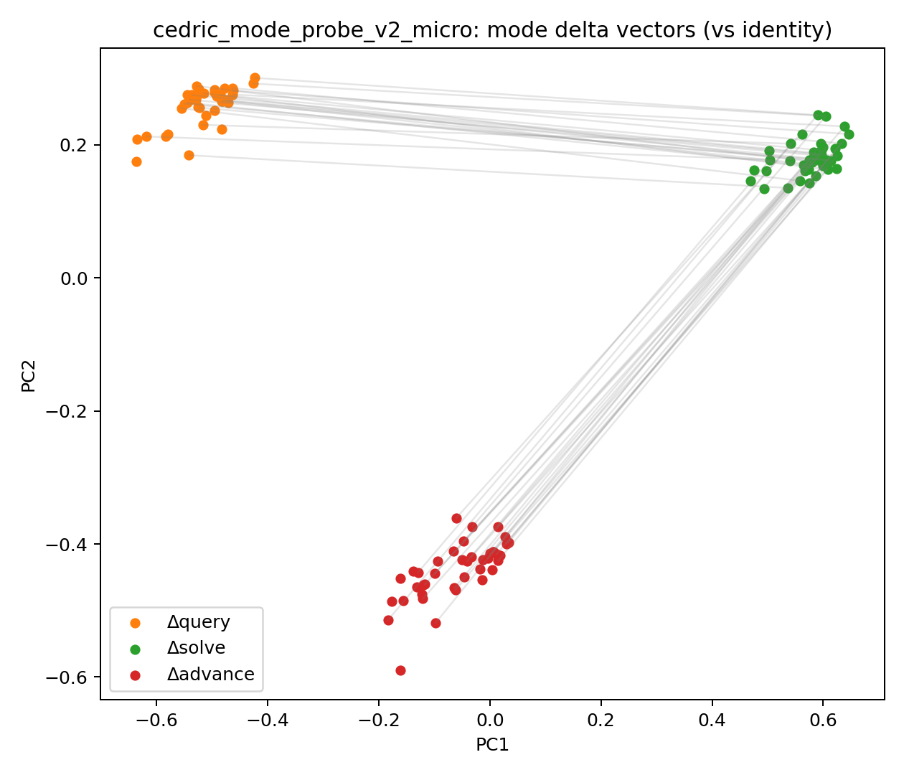
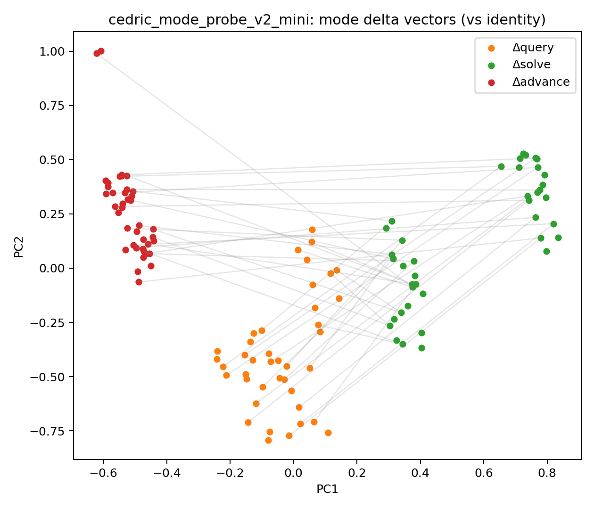
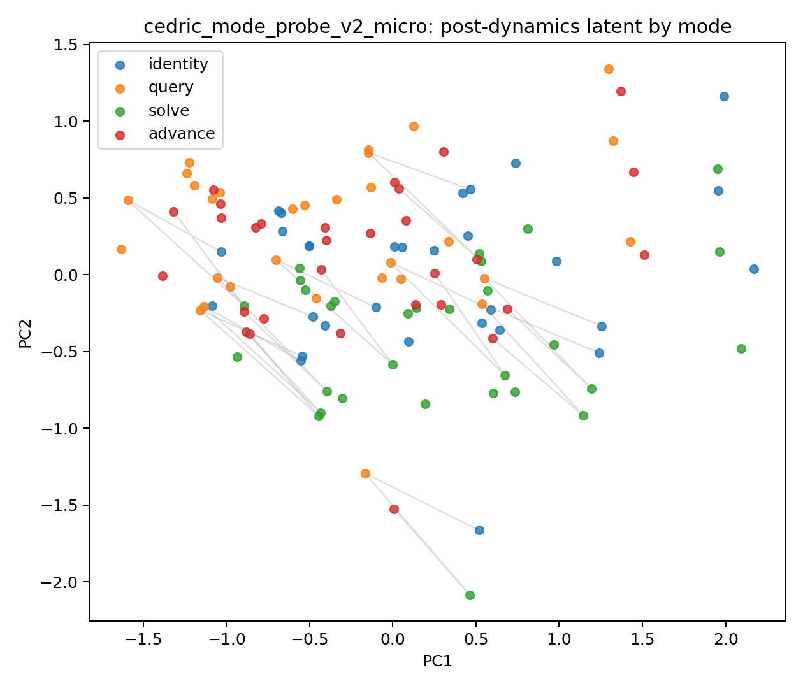
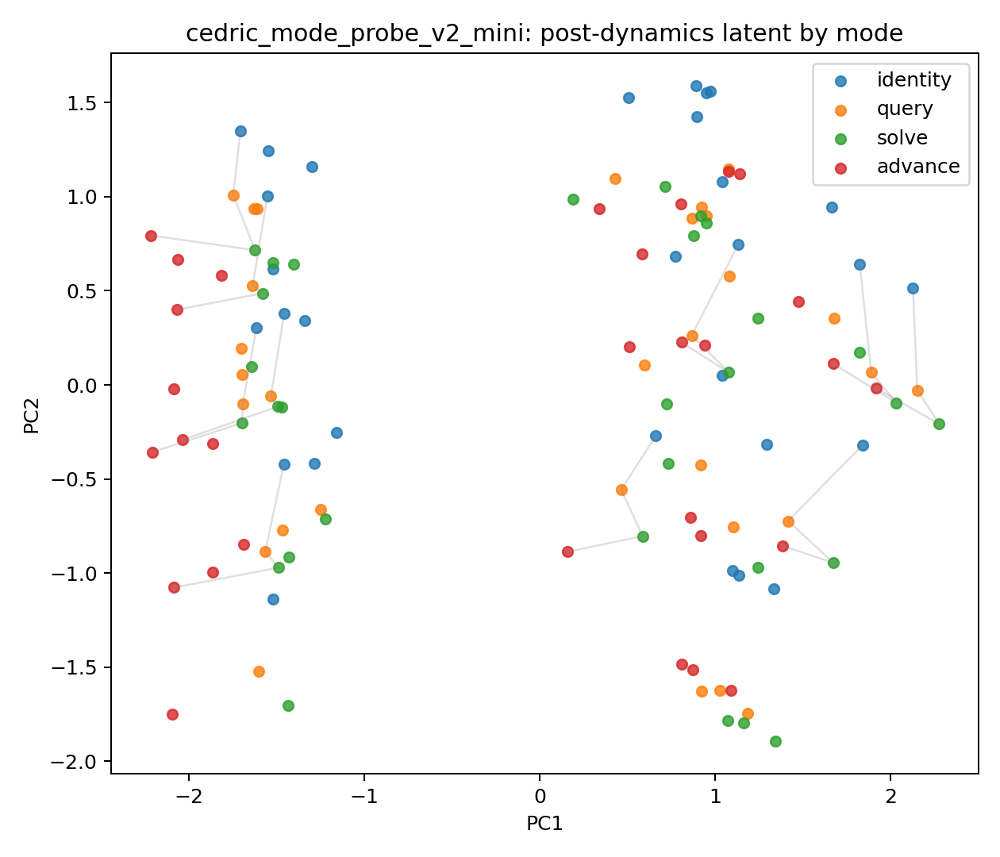
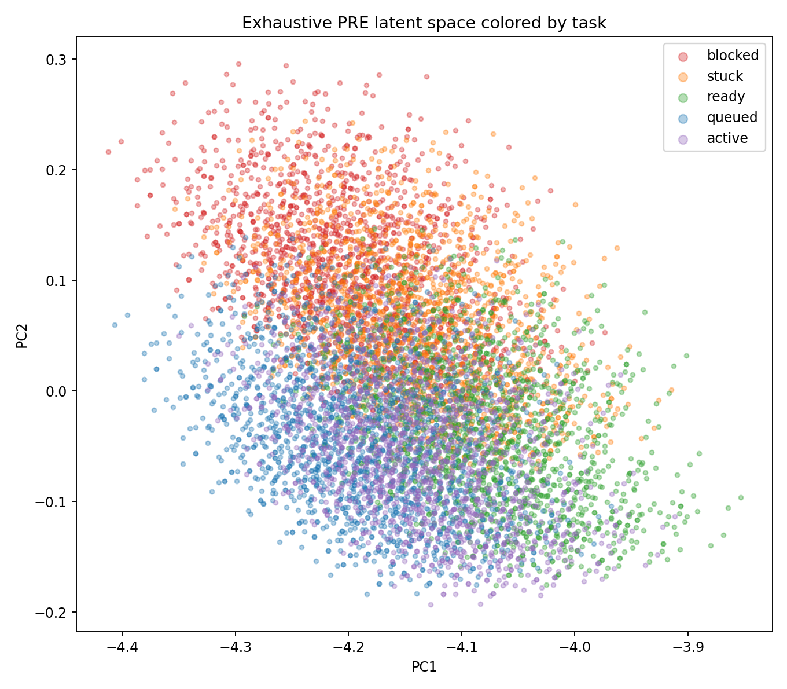
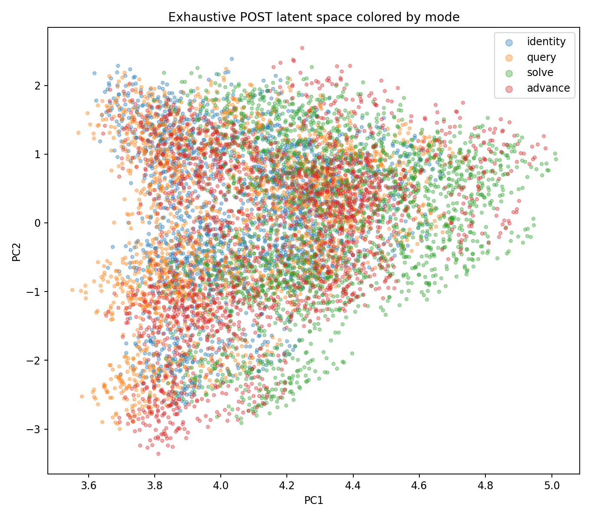
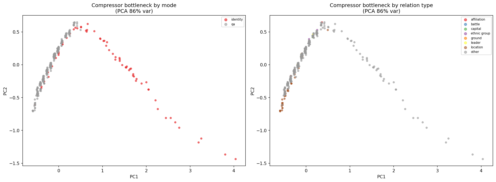
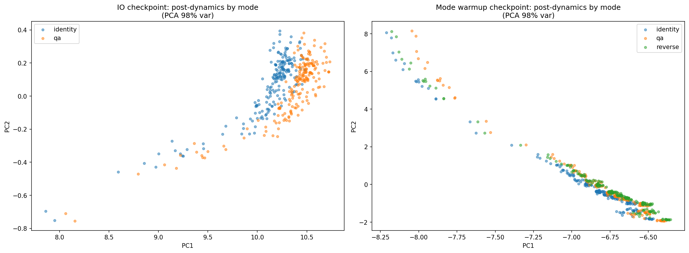
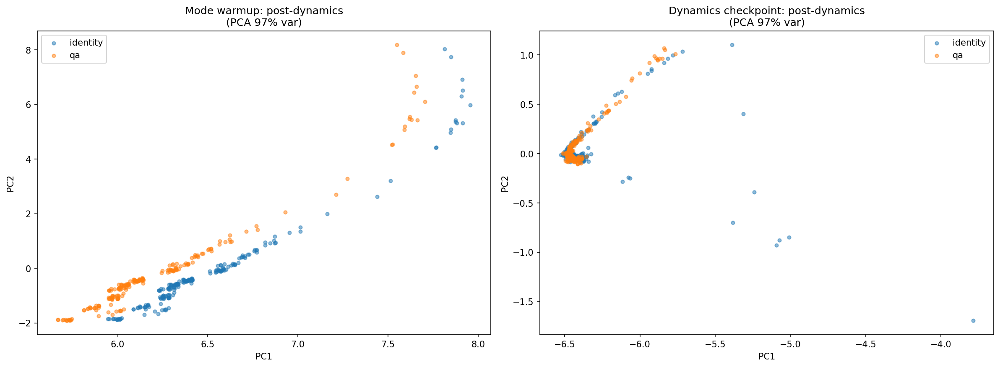

# Sprint 4: Config-Driven Training & Dynamics Core

## Goal

Refactor training from 600-line scripts into config-driven experiments, then train a dynamics core that transforms question bottlenecks into answer bottlenecks — the first real "world model" behavior over open-vocab text.

## Key Results

| Experiment | IO Exact | QA tok_acc | Notes |
|-----------|:--------:|:----------:|-------|
| v19 initial (broken) | 80% plateau | — | adaLN init + missing LayerNorms |
| v19 fixed init | 93.9% @ ep200 | — | Warm-start conditioning proj + restore compressor LNs |
| v19 graduated curriculum | **96.9%** | — | 3-phase t-range: [0.7,1]→[0.4,1]→[0.0,1] |
| v19 dynamics (2L, frozen len) | 99.6% id | 12% qa | Dynamics core too small + length head frozen |
| v20 mode warmup | 96.9% io | 5.5% rev tok | Mode-reading circuitry forms, but reverse doesn't converge |
| v20 dynamics | — | ~12% qa | QA mode-collapses in bottleneck space |

## Infrastructure: Config-Driven Training

Replaced per-experiment scripts with a JSON config + `Trainer` class.

**New files:**
- `src/twm/training_config.py` — `TrainingConfig → StageConfig → PhaseConfig` dataclass hierarchy
- `src/twm/training_losses.py` — `compute_diffusion_loss()` for both IO and dynamics
- `src/twm/training_eval.py` — `assess()` + `print_samples()` with shared generation
- `src/twm/trainer.py` — `Trainer` orchestrator with stage/phase/freeze management
- `scripts/train.py` — 10-line universal entry point
- `configs/v19_mini64.json` — example config

**Key features:**
- Staged training: IO → dynamics with auto-checkpoint chaining
- Per-phase t-range curriculum, metric selection, patience
- Named freeze system: `["compressor", "expander"]` with auto-unfreeze of length head
- Shape-compatible partial weight loading between stages

## Bug Fixes & Findings

### 1. adaLN Initialization Symmetry Breaking

**Problem:** v19's factored adaLN has 3 projections (conditioning, timestep, position). All three were zero-initialized, creating a symmetry-breaking problem — the denoiser started with zero modulation from all sources, couldn't distinguish conditioning signal from noise.

**Fix:** Warm-start the conditioning projection (index 0) with default Kaiming init. Timestep and position projections stay zero-init. The model starts in v18's single-projection optimization landscape and grows into v19's factored design.

**File:** `src/twm/diffusion_decoder.py` — `AdaLNZeroLayer.__init__`

### 2. Compressor LayerNorms

**Problem:** Internal LayerNorms (`cross_ln`, `query_self_ln`, `query_ffn_ln`) were removed in v19 refactor. Without them, bottleneck vectors had inconsistent magnitudes, and the expander couldn't learn a stable mapping.

**Fix:** Restored all three LayerNorms in the extraction pipeline.

**File:** `src/twm/text_compressor.py`

### 3. Tokenizer Missing `?`

**Problem:** The BPE tokenizer was trained on declarative WebNLG sentences only. Questions (generated later by `generate_qa_dataset.py`) use `?`, which encoded as `<unk>` (id=2, zero embedding). 33.6% of identity_test examples had trailing `<unk>` — impossible to reconstruct.

**Diagnosis chain:**
- Systematic last-position errors in diagnostics: `(pos 15: 'aleks'!='')`
- Target decoded to empty because `_clean()` strips whitespace — initially suspected trailing space token (id=87)
- Only 1/5000 examples had trailing space → couldn't explain systematic pattern
- Found actual culprit: `?` → `<unk>` (id=2), and `decode([2])` → `''`
- 33.6% of test examples are questions ending with `?`

**Fix:** Added `initial_alphabet` to `BpeTrainer` in `prepare_webnlg_multimodal.py` ensuring `?` and other common punctuation always get vocab entries. Retrained tokenizer, regenerated all data. Result: 0/9614 test examples contain `<unk>`.

**Files:** `scripts/prepare_webnlg_multimodal.py`, all data in `data/webnlg_multi/`

### 4. Stochastic Eval Mismatch

**Problem:** `assess()` and `print_samples()` each called `model.generate()` independently. Generation starts from `torch.randn` noise, so the two calls produced different outputs. Metrics showed 89% exact but all 5 displayed samples were wrong — different random draws.

**Fix:** `assess()` now returns generation results via `_gen` key. `print_samples()` accepts `gen_cache` parameter to reuse the same generation. Diagnostics now reflect exactly what the metrics measured.

**File:** `src/twm/training_eval.py`, `src/twm/trainer.py`

### 5. Frozen Length Head During Dynamics

**Problem:** The length head is part of the expander. When `freeze: ["expander"]`, the length head freezes too. It was trained to predict length from identity bottlenecks (compressor outputs). Dynamics-transformed bottlenecks are out-of-distribution for the frozen length head.

**Loss decomposition:** Total loss 5.1, MSE 0.01, CE×0.1=0.35. Remaining ~4.7 is length loss. The frozen length head generates massive gradients that dominate training, and the dynamics core spends capacity satisfying the length head rather than learning QA transformations.

**Evidence:** id=0.996 (identity passes through unchanged, length head sees familiar bottlenecks), qa=0.12 (transformed bottlenecks are OOD for frozen length head).

**Fix:** Auto-unfreeze the length head when the expander is frozen. Added to `_apply_freeze()` in `trainer.py`. Length head is tiny (~8K params), adapts quickly to transformed bottleneck distribution.

**File:** `src/twm/trainer.py` — `_apply_freeze()`

### 6. Dynamics Core Capacity

**Problem:** Mini profile gives 2 transformer layers for dynamics. Identity is trivial (near-identity residual), but question→answer requires restructuring the bottleneck — different word order, length, and content. 2 layers couldn't learn the mapping: qa tok_acc plateaued at 12% after 560 epochs.

**Fix:** Added `dynamics_layers: 4` to config (top-level field, not per-stage). Doubles dynamics depth without touching frozen compressor/expander. IO checkpoint loads via shape-compatible partial loading; new dynamics layers stay randomly initialized.

### 7. ByteLevel BPE Position-Dependent Tokenization

**Problem:** ByteLevel BPE with `add_prefix_space=False` tokenizes the same word differently depending on position. At sentence start (no `Ġ` prefix), `amdavad` → `['amdavad']` (1 token). Mid-sentence (with `Ġ` prefix), `amdavad` → `['Ġam', 'davad']` (2 tokens). The dynamics core has to learn that these different token sequences represent the same word — an unnecessary burden.

**Scope:** Affects every QA pair where entities appear at different positions in question vs answer (essentially all of them).

**Fix:** Changed `add_prefix_space=False` → `add_prefix_space=True` in `train_bpe()`. Now every word gets a consistent `Ġ` prefix regardless of position. Retrained tokenizer, regenerated all data.

**Bonus:** Consistent prefix space lets BPE learn better merges. `ahmedabad` went from 3 tokens (`ah` + `med` + `abad`) to 1 token (`Ġahmedabad`). Shorter sequences = less work for the dynamics core.

**File:** `scripts/prepare_webnlg_multimodal.py` — `train_bpe()`

## Architecture Notes

### Graduated t-Range Curriculum

Instead of training on full noise range [0,1] from the start, use graduated phases:
1. **Phase 1** [0.7, 1.0] — high noise only, learn coarse structure. Gate on `tok_acc`.
2. **Phase 2** [0.4, 1.0] — extend into medium noise. Gate on `exact`.
3. **Phase 3** [0.0, 1.0] — full range, fine-tune boundaries. Gate on `exact`.

Each phase extends competence incrementally rather than shocking the model with low-noise gradients that destroy high-noise knowledge.

### Attention Pool vs Mean Pool

Mean pool (`bottleneck.mean(dim=1)`) divides gradients by N×3 (=36). Attention pool (learned query cross-attending to bottleneck) preserves per-position gradient flow. Both the conditioning vector and length head read from the same attention-pooled vector.

### Length Prediction Architecture

Length lives in the expander, not the compressor:
```
bottleneck → cond_attn pool → cond_proj → length_head (2-layer MLP) → scalar
```
During dynamics, the length head reads from the **post-dynamics** bottleneck, predicting the **output** length. The dynamics core must reshape the bottleneck geometry so the length head reads the correct output length.

### Natural MSE/CE Curriculum

MSE dominates early (large gradients when far from targets). CE becomes effective late (at cell boundaries). Explicit CE weight annealing fights this natural process. Keep CE weight constant.

## Dynamics Geometry Analysis (Pet Sim)

To understand *how* the dynamics core transforms state, we ran geometry analysis on the pet sim checkpoint (28K params, mini profile, 98.9% exact match). Tools: `scripts/visualize_dynamics.py` and `src/twm/analysis.py`.

### Latent Space Structure


3,780 states (5 pets × 756 attribute/action combos), PCA to 3D (68.4% variance explained). Each pet starts from a tight pre-dynamics cluster, then fans out into a larger downstream region after the dynamics step. The inputs are encoded compactly, while most of the variation appears in the transition map itself. The downstream clouds differ by pet, so the model is not ignoring identity, but the overall geometry shows dog-specific variation around a common transition mechanism.

### Flow Field


PC1 vs PC2 with displacement arrows. Most transitions move in a broadly similar direction, with different magnitudes and branching angles. The learned dynamics have a dominant global transport component — a shared progression axis corresponding to "advance this state forward" — with smaller local deviations depending on which pet/state you started from.

### Jacobian Eigenspectrum


Jacobian of the dynamics map at a representative state (Daisy, hungry, tired, content, messy, feed). 768×768 Jacobian (24 positions × 32 d_model).

- Eigenvalue magnitude range: [0.0006, 4.88]
- Mean |λ|: 1.0
- 304 expansive directions (|λ| > 1), 455 contractive (|λ| < 1)

The local operators are not simple contractions or random noise — they show heterogeneous structure, including expansive directions and coupled modes. This supports the claim that the core learned real latent dynamics.

### Takeaway

In the pet sim, the dynamics core learned one main next-state prediction function, with pet identity acting mostly as a conditioning signal that slightly changes the shape of the flow rather than selecting entirely different dynamics. This is consistent with the architecture's design: decomposed triples let the transformer share structure across entities, and the input residual means the dynamics only needs to learn the delta.

## Cedric Mode Geometry Probe (Micro vs Mini, closed-vocab)

Cedric (OpenClaw assistant on a hardened local LXC) ran a mode-conditioned geometry probe on a structured assistant dataset (`data/cedric_mode_probe_v2`) with 4 modes (identity, query, solve, advance) to test whether Mini is qualitatively different from Micro in how it organizes mode-conditioned dynamics — or just a larger version of the same thing.

- **Micro**: comp/context F1 ~0.91, exact-match ~0.39-0.44 on hard splits
- **Mini**: 1.00 F1 and exact-match across all v2 splits

Full findings: [`results/cedric_mode_probe_v2_findings.md`](../results/cedric_mode_probe_v2_findings.md)

### Mode Delta Vectors (vs identity)

The clearest signal. Each point is a state's dynamics displacement relative to identity mode, colored by mode. Lines connect the same state across modes.

| Micro | Mini |
|:-----:|:----:|
|  |  |

Micro's mode clusters overlap and transport lines cross — the core is entangling modes, applying partially-shared operators that don't cleanly separate. Mini shows three distinct, coherent clusters with parallel transport. The mode operator is consistent across states: query always pushes in roughly the same direction, solve in another, advance in a third.

Quantitatively (cosine similarity between mode delta vectors): Mini's inter-mode coherence is 0.53-0.70 vs Micro's 0.16-0.57. Mini's operators are more self-consistent.

### Post-Dynamics Latent Space by Mode

| Micro | Mini |
|:-----:|:----:|
|  |  |

Micro's post-dynamics space is a mode-entangled soup — all four modes occupy the same region with heavy overlap. Mini shows clearer spatial separation, particularly for identity (blue) which maintains distinct positioning from the transformation modes.

### Exhaustive Pre/Post Latent Sweep (Mini)

To verify that the sampled probe visuals were not cherry-picked, I also projected an exhaustive lattice sweep on CPU for Mini.

| PRE latent (task) | POST latent (mode) |
|:-----------------:|:------------------:|
|  |  |

The same pattern holds at lattice scale:
- PRE encodings carry broad task gradients.
- POST geometry is materially reshaped by mode-conditioned dynamics.

This corroborates the micro-vs-mini probe: Mini's organization is a real geometric effect, not sampling noise.

### Takeaway

Mini doesn't just have more capacity — it learns a qualitatively different latent organization. The dynamics core develops clean, mode-conditioned transport operators rather than an entangled approximation. Recommendation: use Mini as the default for mode-conditioned reasoning; keep Micro as footprint-first fallback.

## Open-Vocab Bottleneck Geometry (v20)

To understand why dynamics training isn't converging on QA, we visualized the bottleneck geometry at each stage of the v20 pipeline. Tool: `scripts/visualize_bottleneck.py`.

### Plot 1: Compressor Output (IO Checkpoint)



PCA of mean-pooled compressor bottleneck vectors (86% variance in 2 components). Left: colored by mode. Right: colored by relation type.

**Finding: The compressor maps all inputs onto a single curved 1D manifold.** Identity and QA examples are completely interleaved — the compressor is mode-agnostic (expected, since it never sees mode). Relation types cluster: location queries group at one end, affiliation at the other. The bottleneck has meaningful semantic structure, but it's low-dimensional — most variation is captured by a single curve.

### Plot 2: Post-Dynamics — IO vs Mode Warmup



Same inputs run through dynamics with identity (blue) and QA (orange) mode conditioning. Left: IO checkpoint. Right: mode warmup checkpoint (also shows reverse in green).

**Finding: IO checkpoint is mode-blind; warmup learns to read mode.** The IO checkpoint produces complete identity/QA overlap — the dynamics core passes everything through unchanged regardless of mode. This confirms the diagnosis: the core never learned mode-reading circuitry during IO training because it was frozen.

After mode warmup, the three modes separate along PC2. Identity (blue) pulls away from QA/reverse. The core learned to condition on mode. But QA and reverse still overlap heavily — the warmup task (sentence reversal) was too simple to force deep mode separation.

### Plot 3: Post-Dynamics — Warmup vs Dynamics



Left: mode warmup checkpoint. Right: dynamics checkpoint (after QA training).

**Finding: Dynamics training causes QA mode collapse.** The warmup checkpoint shows identity and QA interleaved along the manifold with partial separation. After dynamics training, QA collapses to a tight cluster near the origin while identity points scatter with outliers. The dynamics core learned to do *something* mode-conditional — it pushes all QA inputs to roughly the same bottleneck regardless of content. This is mode collapse: the core found a shortcut (constant QA output) rather than learning content-dependent question→answer transformations.

### Diagnosis

The bottleneck geometry tells a clear story:

1. **Compressor works.** Semantic structure is present — relation types cluster, 86% variance in 2 PCA components. The IO pipeline is solid.
2. **Mode warmup works partially.** The core learns to read mode and separate identity from transformations. But reverse is too simple a task to build deep mode-conditional circuitry.
3. **Dynamics training collapses.** Instead of learning diverse QA transformations, the core maps all QA inputs to a single point. The QA task is too hard to learn from scratch with only mode-reading from warmup — the core takes the path of least resistance.

The fundamental gap: there's no curriculum bridge between "read mode" (warmup) and "transform question→answer" (dynamics). The jump is too large.

## What to Try Next (Sprint 5)

### Primary: Role-Conditioned VAE Prior

The compressor collapses to 1D because the reconstruction loss doesn't constrain internal geometry — any encoding that decodes correctly is equally good. The role centroid regularizer we added is too weak: the centroids are learned and can themselves collapse onto the same curve if that minimizes the combined loss.

A VAE with role-conditioned priors solves this structurally. Instead of "entity slots should be near an entity centroid," it enforces "entity slots must be distributed according to N(μ_E, σ_E), attribute slots according to N(μ_A, σ_A), value slots according to N(μ_V, σ_V), and these three distributions must be distinct." The KL term makes this a hard geometric constraint, not a soft regularizer.

**Why this is the right fix:**
- Directly breaks the 1D manifold. If E/A/V slots are forced into three distinct distributions, the bottleneck is *at minimum* 3-dimensional in role structure, with content variation adding further dimensions within each role.
- The compressor can't collapse everything onto one curve because the KL term penalizes any encoding where entity and value distributions overlap.
- Composes with everything else. Once the bottleneck has genuine role-structured dimensionality, the dynamics core has geometric room to learn "keep entity slots, transform value slots." Contrastive mode loss prevents collapse. Bn_loss gives direct supervision. But none of those matter if the underlying space is 1D.

**Implementation path:**
1. Add μ and log_σ projection heads after the compressor's extraction stage
2. Reparameterize: z = μ + σ · ε
3. KL divergence against three learned role-conditioned priors (one per role)
4. Anneal β from 0 upward during IO training — reconstruction converges first, then the prior gradually imposes structure
5. Monitor KL per role — if one role's KL drops to zero, that role has posterior-collapsed and needs higher β or a more informative prior

**The deeper lesson from comparing Cedric's probe to the WebNLG results:** the closed-vocab dynamics core works beautifully because it operates on real triples with genuinely high-dimensional structure. The open-vocab pipeline collapses that structure into a 1D manifold during compression, then asks the core to do the same job with fundamentally less geometric information. The fix has to restore dimensionality to the bottleneck, not just improve the training curriculum around a 1D space.

### Supporting: Contrastive Mode Loss + Bn Supervision Curriculum

Once the bottleneck has real dimensionality from the VAE prior, these two complement it:

- **Contrastive mode loss**: push same-mode post-dynamics pairs together, different-mode pairs apart. Directly prevents the QA mode collapse from Plot 3.
- **Bn supervision curriculum**: high bn_weight early in dynamics (direct MSE to answer bottleneck), anneal down to let denoise loss take over. Gives the core a geometric target before asking it to generate tokens.

### Extra ideas (lower priority)

- **Stronger warmup tasks**: graduated difficulty (reverse → entity extraction → paraphrase → QA). Good curriculum but doesn't fix the dimensionality problem.
- **Partial freeze relaxation**: unfreeze last compressor layer during dynamics. Superseded by the VAE approach which fixes geometry at the source.
- **Scale up warmup modes**: 4-6 modes instead of 2. Useful for mode-reading but secondary to the structural fix.

## Current Config

```json
{
    "model_type": "dynamics",
    "profile": "mini",
    "d_model": 64,
    "dynamics_layers": 4,
    "max_triples": 12,
    "text_compressor_layers": 3,
    "text_expander_layers": 3,
    "max_text_tokens": 64,
    "dropout": 0.1,
    "alpha_min": 0.01,
    "data_dir": "data/webnlg_multi",
    "tokenizer_path": "data/webnlg_multi/shared_bpe_tokenizer.json",
    "out_dir": "results/v20_mini64",
    "batch_size": 64,
    "denoise_steps": 10,
    "aux_ce_weight": 0.1,
    "length_weight": 0.25,
    "log_every": 10,
    "diagnostic_every": 50,
    "stages": [
        {
            "name": "io",
            "dataset": "identity",
            "lr": 3e-4,
            "max_examples": 15000,
            "phases": [
                {"t_min": 0.7, "t_max": 1.0, "epochs": 400, "patience": 100},
                {"t_min": 0.4, "t_max": 1.0, "epochs": 400, "patience": 100, "metric": "exact"},
                {"t_min": 0.0, "t_max": 1.0, "epochs": 800, "patience": 150, "metric": "exact"}
            ]
        },
        {
            "name": "mode_warmup",
            "dataset": "mode_warmup",
            "freeze": ["compressor", "expander"],
            "max_examples": 15000,
            "phases": [
                {"t_min": 0.0, "t_max": 1.0, "lr": 1e-3, "epochs": 200, "patience": 50}
            ]
        },
        {
            "name": "dynamics",
            "dataset": "qa",
            "freeze": ["compressor", "expander"],
            "lr": 3e-4,
            "max_examples": 30000,
            "phases": [
                {"t_min": 0.0, "t_max": 1.0, "bias_power": 2.0, "epochs": 800, "patience": 150}
            ]
        }
    ]
}
```
