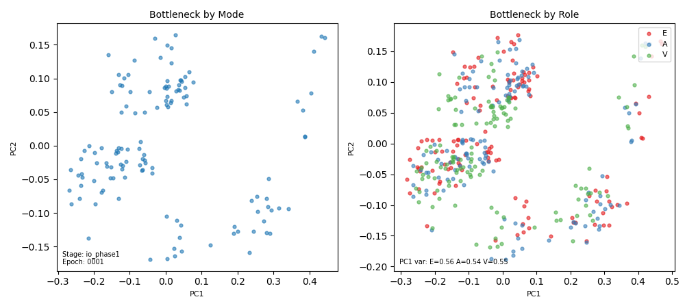
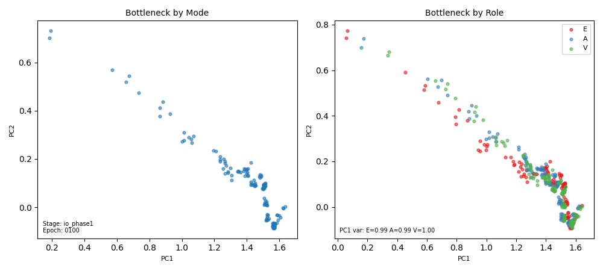
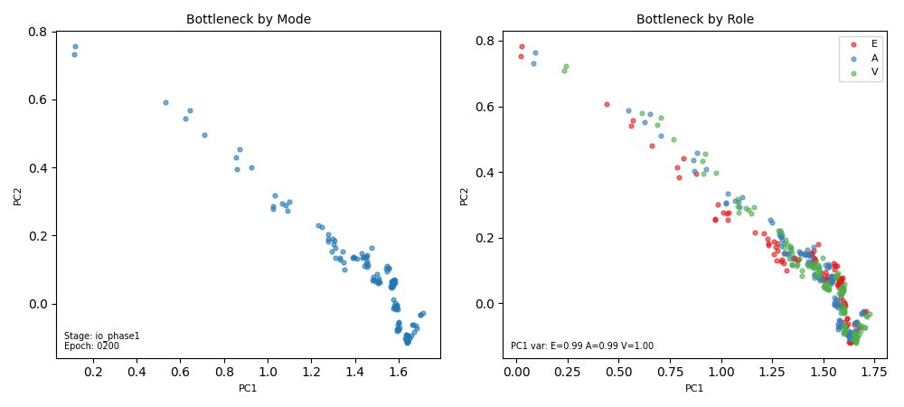

# Sprint 5: VAE Bottleneck & Latent Collapse

## Goal

Add a VAE bottleneck with role-conditioned priors to the compressor, then investigate and fix latent space collapse during staged training.

## Key Results

| Experiment | Architecture | Collapse? | Per-role PC1 var | Notes |
|-----------|:------------|:---------:|:----------------:|-------|
| v21 micro (d=16, 1L) | VAE + IO only | Yes | E=1.0 A=1.0 V=1.0 | Collapses by epoch ~30 |
| v21 full (d=64, 3L) | VAE + IO only | **Yes** | E=0.99 A=0.99 V=1.0 | Collapses by epoch ~50 |

## VAE Bottleneck (v21)

Added `vae=True` mode to compressor: reparameterized bottleneck with role-conditioned priors (separate learned mean/logvar per entity/attribute/value position). KL divergence annealed from 0 to `kl_weight` over `kl_anneal_epochs`.

**Files:** `src/twm/text_compressor.py`, `src/twm/training_config.py`

## In-Training Latent Visualization

Built a PCA scatter-plot snapshot system to watch bottleneck geometry evolve during training. Produces numbered frames that assemble into video via ffmpeg.

**Features:**
- Consistent PCA basis: fit on epoch 1, reused for all subsequent frames
- Dual subplot: left colored by mode (identity/qa/reverse), right colored by role (E/A/V)
- Per-role PC1 explained variance annotated on each frame (collapse signal)
- Independent of `log_every` / `diagnostic_every` — controlled by `snapshot_every`
- ~50KB per frame at 100 DPI

**Files:** `src/twm/training_eval.py` (`save_latent_snapshot`), `src/twm/trainer.py`, `src/twm/training_config.py` (`snapshot_every`)

**Usage:**
```bash
# Training with snapshots
uv run python scripts/train.py configs/v21_vae_mini64.json  # snapshot_every: 10

# Assemble video
ffmpeg -framerate 8 -pattern_type glob \
  -i 'results/.../frames/*.png' \
  -c:v libx264 -pix_fmt yuv420p latent_evolution.mp4
```

## Critical Finding: Bottleneck Collapses to 1D

PCA visualization confirmed that the VAE bottleneck collapses to a **1D manifold** during IO-only training — at full scale (d_model=64, 3L compressor/expander), not just micro.

**Timeline (v21 full, d=64):**
- Epoch 1: 2D spread, per-role PC1 var ~0.55 (uniform across E/A/V)
- Epoch 20-50: KL annealing drives collapse
- Epoch 100+: PC1 explains 99-100% of variance for all roles — 1D arc

**Root cause:** The expander only needs to invert the compressor for identity-mode reconstruction. A 1D manifold is sufficient. KL pressure flattens everything the dynamics core would need.

**Implication:** Staged training (IO → dynamics) may be fundamentally flawed. The dynamics core needs latent dimensionality to navigate the space, but by the time it arrives the geometry is already collapsed.

### Example frames

Epoch 1 (2D structure intact):


Epoch 100 (collapsed to 1D arc):


Epoch 200 (locked in):


Full video: `results/test_snapshot/latent_evolution.mp4`

## Candidate Fixes

1. **Joint training:** Train dynamics alongside IO from the start. Its need for dimensionality creates back-pressure against collapse. Breaks staged assumption but addresses root cause.
2. **Spectral penalty:** Penalize when bottleneck covariance eigenvalue ratio exceeds a threshold during IO. A "structure tax" that holds the space open.
3. **Soft staging:** Short IO warmup (non-garbage expander), then bring dynamics online early with low LR before collapse completes.

## Next Steps

- [ ] Implement and test spectral penalty or joint training
- [ ] Re-run with fix, verify latent space maintains dimensionality via snapshot video
- [ ] If latent structure holds, evaluate dynamics core on QA task
