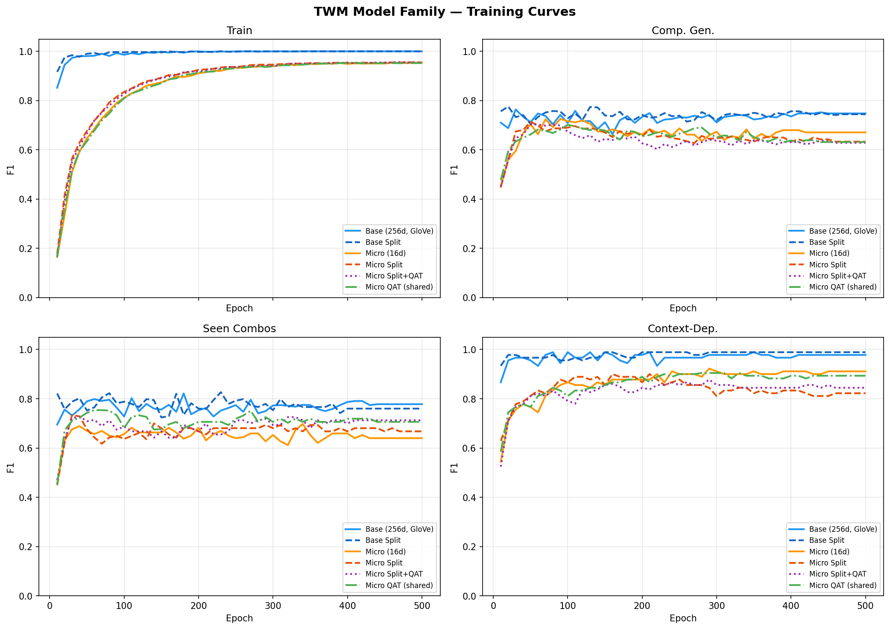

# Results

## Directory Structure

```
results/
  01_handwritten_only/       First model, 121 HW examples only
  02_added_propara/          Added ProPara (859 train)
  03_glove_control_random_init/  Random embed control for GloVe A/B test
  04_glove_pretrained/       GloVe 300d pretrained embeddings
  05_three_domains/          HW + ProPara + OpenPI (1288 train)
  06_expanded_tests/         Same model, harder test sets (55+26)
  07_ablation_no_propara/    Ablation: removed ProPara from training
  08_context_dependent/      Context-dependent attention test [CANONICAL]
  comparisons/               Cross-model comparisons (LLM, MLP, charts)
  family_benchmark/          Model family scaling experiments (Sprint 2)
```

Each run directory contains: `config.json`, `train_log.jsonl`, `vocab.json`,
`model_best.pt`, `model_final.pt`, and a `NOTES.md` with context and metrics.

## Progression

| # | Run | Comp Gen F1 | Seen F1 | What Changed |
|---|-----|:-----------:|:-------:|-------------|
| 1 | Handwritten only | 0.770 | 0.971 | Baseline |
| 2 | + ProPara | 0.758 | 0.943 | +738 location triples |
| 3 | Random init control | 0.752 | 0.933 | Deduped, control for GloVe |
| 4 | GloVe pretrained | 0.775 | 0.905 | +2.3% from embeddings |
| 5 | + OpenPI | 0.836 | 0.877 | +429 diverse attributes |
| 6 | Expanded tests | 0.741 | 0.738 | 55+26 harder cross-domain tests |
| 7 | No ProPara ablation | 0.717 | 0.709 | ProPara removal hurts (-2.4%) |
| 8 | Context-dependent | 0.740 | 0.773 | +83 cross-entity examples, alice/bob/carol |

## The Attention Test (run 08)

The key experiment: transitions where the same triple's outcome depends on
other triples in the state. The MLP processes each position independently
and cannot learn these; the transformer attends across positions.

### Context-Dependent Test (30 examples)
| Model | Exact F1 | Exact Match | Delta F1 |
|-------|:---:|:---:|:---:|
| Copy baseline | 0.29 | — | — |
| Qwen3-VL 8B (5-shot) | 0.59 | 0.20 | — |
| MLP + GloVe | 0.76 | 0.50 | 0.73 |
| **TWM (ours)** | **0.99** | **0.97** | **0.98** |

On standard tests TWM leads MLP by 4-8%. On context-dependent tests: **+23% F1**.

The MLP fails specifically on "no-change" cases where it must check other
entities to know nothing happens:
- `flask full + nobody thirsty` -> MLP empties the flask
- `door closed + nobody pulling` -> MLP opens the door
- `bob lonely + everyone far` -> MLP makes bob social
- `carol tired + bed occupied` -> MLP rests carol

TWM wins 15/30 examples the MLP gets wrong. MLP wins 0.

### Full 4-Way Comparison (Exact F1)
| Model | Context (30) | Comp Gen (55) | Seen (26) |
|-------|:---:|:---:|:---:|
| Copy baseline | 0.29 | 0.29 | 0.29 |
| Qwen3-VL 8B 5-shot | 0.59 | 0.56 | 0.57 |
| MLP + GloVe | 0.76 | 0.70 | 0.64 |
| **TWM (ours)** | **0.99** | **0.74** | **0.77** |

### Key Findings
1. **Attention is essential for cross-entity reasoning**: +23% F1 on context-dependent tests.
2. **TWM beats 8B LLM** on all splits. 3M params vs 8B.
3. **Compositional generalization confirmed**: 74% exact F1 on novel combos.
4. **Entity embeddings matter**: alice/bob/carol (GloVe sim 0.28) vs person_a/person_b (sim 0.62).
5. **Multi-domain training helps**: 3 domains > 2 > 1.

---

## Model Family Benchmark (Sprint 2)

Scaling experiment: can TWM's attention advantage survive aggressive compression?
Trained 6 variants on the combined dataset (1,371 train examples) for 500 epochs.

### Variants

| Model | d_model | Layers | Heads | Params | Size (f32) |
|-------|--------:|-------:|------:|-------:|-----------:|
| Base (GloVe) | 256 | 4 | 4 | 4.5M | 17.3 MB |
| Base Split | 256 | 4 | 4 | 4.5M | 17.0 MB |
| Micro | 16 | 1 | 2 | 80K | 311 KB |
| Micro Split | 16 | 1 | 2 | 85K | 334 KB |
| Micro Split+QAT | 16 | 1 | 2 | 85K | 334 KB |
| Micro QAT (shared) | 16 | 1 | 2 | 80K | 311 KB |

"Split" = separate entity/attr/value embedding tables and output heads.
"QAT" = quantization-aware training (simulated int8 noise during forward pass).

### Results (F1)

| Model | Comp Gen (55) | Seen (26) | Context-Dep (30) | Train |
|-------|:---:|:---:|:---:|:---:|
| Base (GloVe) | 0.748 | 0.778 | 0.978 | 1.000 |
| Base Split | 0.745 | 0.760 | **0.989** | 1.000 |
| Micro | **0.671** | 0.640 | **0.911** | 0.953 |
| Micro Split | 0.633 | 0.668 | 0.822 | 0.955 |
| Micro Split+QAT | 0.629 | 0.712 | 0.844 | 0.955 |
| Micro QAT (shared) | 0.632 | 0.706 | 0.893 | 0.952 |

### Key Findings

1. **Micro is viable.** 80K params (57x smaller than base) retains 0.91
   context-dependent F1 — the attention mechanism works at 16d/2-head.
2. **Split embeddings hurt at micro scale.** At 16d there aren't enough
   dimensions for separate tables to learn useful representations. Split helps
   base (0.989 vs 0.978 context) but hurts micro (0.822 vs 0.911 context).
3. **QAT is essentially free.** Micro QAT shared: 0.893 context F1 vs 0.911
   plain — minimal degradation from simulated int8 quantization noise.
4. **ESP32 target met.** With a domain-specific vocab (~50 tokens), micro
   achieves ~4.4K params / ~5 KB at int8. Attention advantage preserved.

### Final F1 Comparison


### Size vs. Accuracy Tradeoff


### Training Curves



---

## comparisons/

- `llm_bench_{split}_5shot.json` — Per-example Qwen3-VL 8B results
- `semantic_comparison.json` — TWM vs LLM semantic eval summary
- `context_dependent_comparison.png` — Context-dependent attention test chart
- `fair_comparison.png` — Semantic F1 bar chart (TWM vs LLM)
- `full_comparison.png` — 4-way comparison bar chart
- `mlp_vs_transformer.png` — MLP baseline comparison
- `pretrained_vs_baseline.png` — GloVe vs random init comparison
