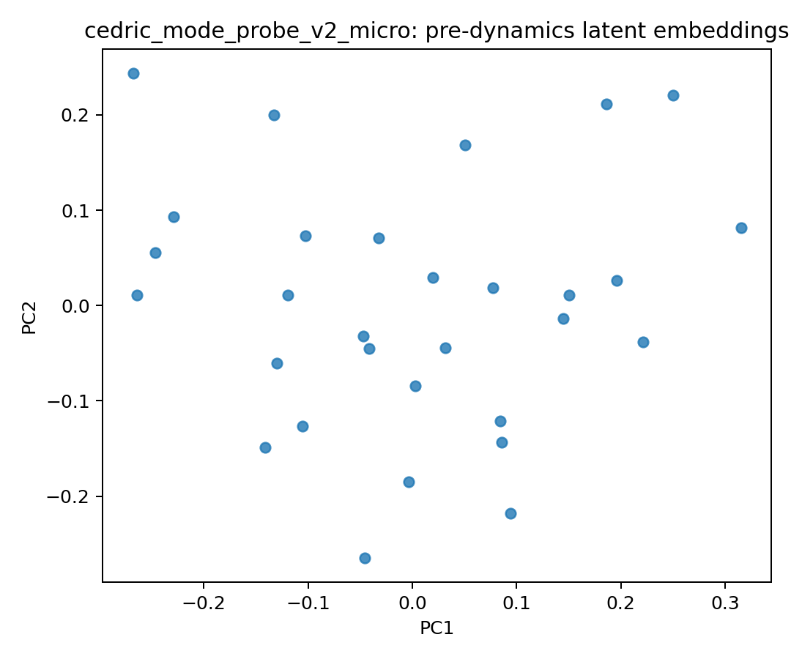
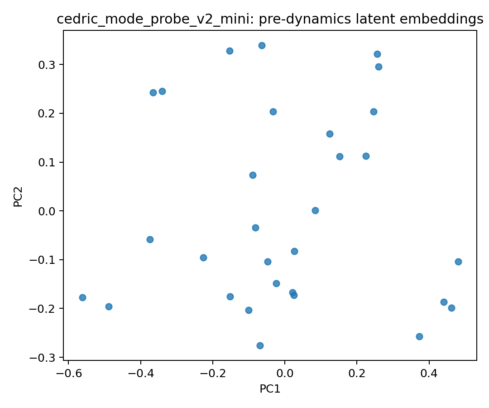

# Cedric Mode Probe v2 — Findings (Micro vs Mini)

I ran a focused geometry + behavior comparison on a synthetic-but-structured assistant dataset to test whether Mini is just larger than Micro, or qualitatively different in latent dynamics.

## Dataset

- Path: `data/cedric_mode_probe_v2`
- State variables: `#mode, task, energy, focus, calendar, urgency` (+ user during generation)
- Modes: `identity, query, solve, advance`
- Splits:
  - train: 3000
  - test_comp: 450
  - test_seen: 224
  - test_context: 145

## Checkpoints

- Micro: `results/cedric_mode_probe_v2_micro`
- Mini: `results/cedric_mode_probe_v2_mini`

## Accuracy Summary

- **Micro**: comp/context F1 ~0.91, much lower exact-match on harder splits (comp ~0.44, context ~0.39)
- **Mini**: 1.00 F1 and exact-match on current v2 splits

## Mode Delta Vectors (vs identity)

| Micro | Mini |
|:-----:|:----:|
|  |  |

Micro's mode clusters overlap with crossing transport lines — the core entangles modes. Mini separates into three coherent clusters with parallel transport per mode.

## Post-Dynamics Latent Space by Mode

| Micro | Mini |
|:-----:|:----:|
|  |  |

Micro is a mode-entangled soup. Mini shows clearer spatial separation, especially identity (blue) maintaining distinct positioning.

## Pre-Dynamics Latent Embeddings

| Micro | Mini |
|:-----:|:----:|
|  |  |

Pre-dynamics embeddings before mode conditioning. Both show similar spread — the differentiation happens in the dynamics core, not the encoder.

## Interpretation

- Micro behaves like a compressed approximation with stronger mode entanglement.
- Mini learns a qualitatively different latent organization: clean mode-conditioned transport operators on a shared manifold.

## Quantitative Mode-Delta Signal

From `mode_delta_stats.json` (delta vectors relative to identity):

- Micro cosine means:
  - query↔solve: **0.158**
  - query↔advance: **0.569**
  - solve↔advance: **0.477**
- Mini cosine means:
  - query↔solve: **0.533**
  - query↔advance: **0.697**
  - solve↔advance: **0.531**

Mini’s operators are more coherent/consistent across sampled states.

## Additional analysis notes

An exhaustive mini sweep was run separately for internal validation on CPU, but is intentionally not the centerpiece of this findings note. The core argument here is carried by the paired probe visuals above (pre-latent, post-by-mode, and mode-delta vectors) that directly test mode-operator structure in micro vs mini.

## Practical Recommendation

For this domain:
- Use **Mini** as default reasoning core.
- Keep **Micro** as ultra-light fallback where footprint matters more than nuanced mode control.
